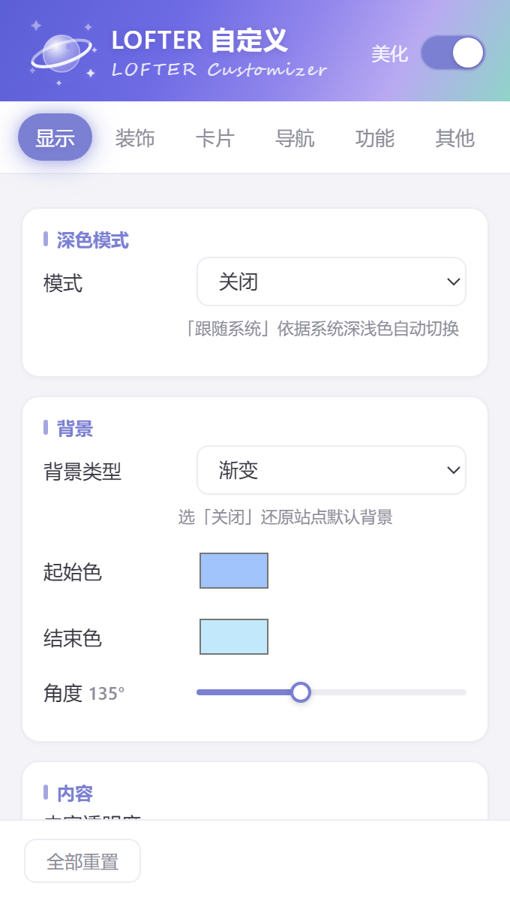
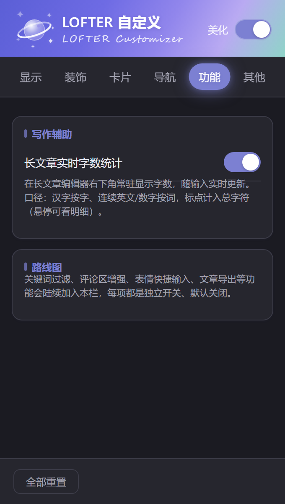

# Lofter Customizer（LOFTER 自定义）

> 一个为 LOFTER 带来暗色模式、玻璃卡片材质、自定义背景与装饰、关键词 / 用户过滤的浏览器美化扩展。纯本地运行，不上传任何数据。

  
  
   
  设置面板：六栏信息架构 + 暗色自动跟随（真实渲染截图，重出图见 <code>tools/panel-shot.py</code>）

  <!-- 【待补：LOFTER 页面暗色开关前后对比 GIF，文件名 dark-before-after.gif，传好后取消下行注释即可】
  
  -->

  <!-- 【待补：玻璃材质对比图（导航栏 / 右侧栏 / 卡片三处），文件名 glass-materials.png，传好后取消下行注释即可】
  
  -->

  <!-- 【待补：评论区用户过滤前后对比 GIF，文件名 comment-filter.gif，传好后取消下行注释即可】
  
  -->

---

## ✨ 功能特性

### 🎛 设置面板
- **页面内悬浮按钮**：不必再点工具栏图标——按钮常驻页面边缘，可拖动、停靠左右两侧并**记住位置**，拖动时面板实时跟随
- **展开方向自适应**：角部上下展开、垂直中部侧向展开、窗口过窄时自动压缩，展开后**始终不遮挡按钮**
- **六栏信息架构**：显示 / 装饰 / 卡片 / 导航 / 功能 / 其他，栏内再按「深色模式 / 背景 / 字体」等二级分组组织
- 面板配色固定蓝紫、不随页面主题色漂移；网页开暗色（手动或跟随系统）时**面板自动变暗**，词卡与音效两个弹窗同步适配
- **长说明收进 `?` 折叠**：玻璃、材质这类参数多的分组，正文只留开关与滑杆，原理与取舍点一下 `?` 再看，面板不再被大段解释撑高
- **联动显隐**：滑杆只在对应开关打开时出现（如「卡面不透明度」仅在淡透底 / 浅色毛玻璃开启后显示），材质档仅在玻璃开启后出现
- 按钮图标为纯 CSS 分层绘制（星球 + 完整星环 + L），无位图依赖

### 🌙 暗色模式
- **三档模式**：关闭 / 手动开启 / 跟随系统，一键切换或快捷键直达
- 新旧两套页面全覆盖：旧版页面反色管线 + 新版 React 页面直绘管线，双管线并行适配
- **卡片亮度可调**，暗色下背景图仍可透出，支持内容透明度微调护眼
- **信息流淡透底（实验）**：卡面改成半透明深色底、背景极淡透出，实度 0.35~0.92 可调；卡面另加一道 inset 高光描边，给透明玻璃一点「厚度」。悬停时高光不会消失
- 深度适配三十余处页面与弹窗（见下方覆盖清单），细节到下拉框、滚动条、勾选框、雪碧图按钮

### 🖼 背景与装饰
- 四种背景类型：**纯色 / 渐变 / 图案（网格·圆点·条纹）/ 自定义图片**（支持 GIF、含模糊度调节）
- **页面装饰图**：自由添加多张贴图，可视化拖拽 / 缩放编辑位置，可设为「覆盖卡片」模式保证点击响应，一键显示/隐藏
- **装饰互动效果**：呼吸 / 浮动待机动画，点击热区与挤压回弹（弹性风格可调），点击弹出 emoji 粒子，自定义音效与词卡弹窗
- 内容透明度独立控制，背景与阅读互不干扰

### 🔲 卡片
- 圆角大小、卡片间距、阴影全局可调
- **出现动画**：上浮 / 淡入 / 缩放进入 / 侧面滑入，支持交错节奏与时长调节
- **卡片材质**（同一组三档，可叠加）：
  - **暗色 · 半透明底**：卡面淡透底 + 不透明度可调（0.35~0.92），卡隙会露出背景；配 inset 高光描边做「玻璃厚度」
  - **浅色 · 毛玻璃（实验）**：真 `backdrop-filter` 模糊——背景透过卡面被真实模糊，而不是单纯调低不透明度；卡面不透明度 0.4~0.85 可调。掉帧可关
  - **卡面自适应材质**（默认开）：按卡面背后的背景亮度自动切换材质——背景偏暗就切「深膜 + 白字」，浅背景回浅膜黑字，换图 / 滚动都会重新采样

### 🔤 字体与导航
- **字体预置**：一键填入三款推荐字体的字体名（**思源黑体 / 霞鹜文楷 / 鸿蒙 Sans**），也可手动输入任意字体名
- 全局字号缩放
- **导航栏玻璃两档（互斥）**：毛玻璃（低透，磨砂遮住背后内容）/ 液态玻璃（高透，边缘折射 + 焦散，自动适配深浅材质），自定义回顶按钮图片与搜索框占位文字
- **右侧栏玻璃**：把首页右侧栏的卡片换成玻璃卡片，与导航栏同一套引擎但用另一组参数（竖长卡片需要更大的边缘弯曲带才有透镜感）
  - 默认走**纯磨砂** `blur(18px)`：GPU 加速、开销低；**边缘折射**是实验项——它在 Chromium 里走软件光栅化，卡片常驻视口会持续占用，观感接近但开销差一个量级，故默认关
  - 没有折射时用**内侧高光 + 1px 亮边**补偿通透感
  - 材质三档（跟随 / 亮 / 暗），暗色下侧栏不再靠反色实现，而是「深色玻璃 + 白字」直接给色，卡内站点底色会被清成透明，强调色（关注数 / HOT 标）还原为站点原色

**字体怎么用**：扩展**不打包字体文件**——三款 CJK 字体合计 15–25MB，会让安装包和加载速度明显变差。字体装在你自己的系统里，扩展只负责把字体名写进网页样式：

1. 从下表下载并**安装到操作系统**（Windows：右键字体文件 → 为所有用户安装；macOS：双击 → 安装字体）
2. 在面板「字体」页选中对应预置，字体名会自动填入下方输入框；也可直接手输系统里已有的任意字体名
3. 没装该字体时会自动回退到系统默认字体，不会显示异常

| 字体 | 下载地址 | 许可 |
|---|---|---|
| 思源黑体 Source Han Sans | [GitHub Releases](https://github.com/adobe-fonts/source-han-sans/releases) | SIL OFL 1.1 |
| 霞鹜文楷 LXGW WenKai | [GitHub Releases](https://github.com/lxgw/LxgwWenKai/releases) | SIL OFL 1.1 |
| HarmonyOS Sans | [华为开发者联盟 · 设计资源](https://developer.huawei.com/consumer/cn/design/resource-V1)（「通用设计」栏目） | 华为官方免费商用许可 |

> 多词字体名不用加引号（如 `LXGW WenKai`）；用逗号可写多个候选名，浏览器按顺序取第一个已安装的（面板预置已经这么配好了）。

### 🧹 关键词 / 用户过滤
面板 →「功能」栏。**三个生效范围各自独立**：首页时间线 / 标签页 / 评论区，勾哪个生效在哪。

- **关键词**：命中标题、正文或标签即隐藏。一行一个或用中英文逗号分隔，不区分大小写。只作用于帖子卡片——评论正文太短，关键词误杀率不可控，评论区不参与关键词匹配
- **屏蔽用户**：在首页 / 标签页 / 评论区里，帖子或评论的**作者名旁悬停**会浮现「隐藏 / 拉黑」（平时不显示，不干扰阅读）
  - **隐藏** = 仅自己不看、对方无感，TA 的帖子与**评论一起隐藏**
  - **拉黑** = 走官方接口做服务端隔离（对方可能感知，等价于官方「设置 → 黑名单」）；**本地隐藏先行生效**——即便当前域名调不通官方接口（子域博文页跨域），点完也能立刻看不到
  - 被屏蔽的用户随时可在面板里移除
- **评论区隐藏**：同时覆盖三种形态——帖子详情页直接在文档里的评论、首页 / 标签页展开的评论卡片、以及独立的评论 iframe（`comment.do`）。「回复 @某人」的提及链接、正文里贴的主页链接都不会误伤（只认作者名与头像位置的链接）
- **官方黑名单并入评论区**：一个开关即可让官方黑名单成员在评论区一并隐藏。名单同步到本地，开关一开立即刷新，无需重载页面
- **隐藏后不留痕迹**：整行收起（不会留下半截头像或残影边框）、定高容器残留的空白自动收掉、两行贴到一起时只保留一条分割线；「查看更多」把内容撑回来后高度自动跟随
- 「已过滤 N 条」提示可关

### 🔍 实用工具
- **长文章搜索框**：关键词快速检索自己的长文章，支持勾选后**一键批量删除**（告别原版逐篇点删除再确认）
- **归档页搜索框**：搜索结果以网格缩略形式直接在归档页查看，不再跳回个人主页
- **自动获取图片/视频博文标题**：在个人主页为图片/视频作品补显大标题（原版标题只存在于浏览器标签页里）；开启后归档页搜索框也能命中图片/视频作品

### ⚙️ 功能（往页面注入的功能开关）
本栏的功能**一律独立开关、默认关闭**——不会在你升级后悄悄改变页面行为，某个功能不合口味也能单独关掉。

- **长文章实时字数统计**：在长文章编辑器右下角常驻显示字数，随输入实时更新（含「长文章编辑弹窗」场景）。口径为**汉字按字、连续英文/数字按词，标点计入总字符**，鼠标悬停可看「汉字 / 英文数字词 / 总字符」明细
- **关键词 / 用户过滤** 与 **官方黑名单管理**：见上方「关键词 / 用户过滤」一节

### 💾 配置导入导出
- **导出**：一键导出全部设置，或只勾选某几个模块（显示 / 装饰 / 卡片 / 导航 / 功能 / 其他）导出
- **导入**：选择 JSON 文件后按模块覆盖——没包含在文件里的模块保持当前值不动，方便只恢复被自己改坏的那一栏
- 导出文件是**纯 JSON 文本**（含设置项、装饰图、背景图等），可自行留存或分享；实现走 Blob + `<a download>`，**不申请 `downloads` 权限**，全程无任何网络请求

### ⌨️ 快捷键
- `Ctrl+Shift+H` 显示/隐藏装饰图 · `Alt+Shift+E` 进入/退出装饰图编辑位置 · `Ctrl+Shift+K` 切换深色模式（面板内可跳转浏览器改键）

### 📄 页面适配覆盖
首页发布栏 · 首页右侧栏玻璃卡片 · 帖子详情页评论区（含独立评论 iframe）· 草稿页 · 话题页 · 发现页（含专题页）· 我关注的人 · 查看更多页 · 创作者中心 · 连载作品管理 · 章节管理与章节编辑 · 批量管理日志页 · 标签页 · 长文章编辑弹窗 · 合集/系列 · 登录页 · 帮助与客服中心 · 政策文档页 · 各类全局弹窗……

## 📦 安装

**Edge / Chrome 商店**：上架审核中，敬请期待。

**手动安装（开发者模式）**：
1. 下载本仓库（`Code → Download ZIP` 或 `git clone`）
2. 打开浏览器扩展管理页（`edge://extensions` 或 `chrome://extensions`）
3. 开启右上角「开发人员模式」→「加载解压缩的扩展」→ 选择仓库目录
4. 打开任意 LOFTER 页面即可生效

> 详细图文见 [docs/install.md](docs/install.md)

## 🚀 快速开始

1. 在任意 LOFTER 页面点击右下角的**悬浮按钮**（或工具栏图标）打开「LOFTER 自定义」面板
2. 在「显示」栏选暗色模式档位，调一下卡片亮度
3. 到「卡片」栏开圆角、挑一个出现动画
4. 换上你喜欢的背景图和字体，完成 🎉
5. 想开额外功能（长文章字数统计、关键词 / 用户过滤），去「功能」栏按需打开开关

所有设置**实时生效**，仅保存在你自己的浏览器本地。

## ⚙️ 配置说明

- 配置存储于 `chrome.storage.local`（键名 `lc_settings_v1`），**不收集、不上传任何数据**
- 支持一键全部重置
- 支持**配置导入导出**（全部 / 按模块，见「其他」栏 →「数据」），改坏了可以随时恢复

## ❓ FAQ

**Q：某个页面突然没效果了？**
LOFTER 前端使用混淆哈希类名（如 `mYE4Q6nEKlrZElDM0nX3WQ==`），且部分页面容器类名带随机数字、**每次加载都会变化**。站点前端更新可能导致选择器暂时失效。提 [Issue](https://github.com/Li1vErk/Lofter-Customizer/issues/new?template=bug_report.md) 时请附上：失效页面 URL + 控制台输出 + 截图，我们会尽快适配。

**Q：「手动开启」和「跟随系统」有什么区别？**
手动开启后无论系统主题如何都保持暗色；跟随系统则随系统深浅色自动切换。

**Q：会拖慢网页吗？**
扩展为纯内容脚本注入，无后台常驻逻辑；仅在 DOM 变化时按需重绘样式。玻璃类效果里，**默认档一律走 GPU**（侧栏磨砂、导航栏毛玻璃），重的折射滤镜按需开启——见下一问。

**Q：液态玻璃 / 边缘折射为什么默认关着？**
因为它们用的 SVG 引用滤镜在 Chromium 里走**软件光栅化**：元素常驻视口就持续占用，实测会拖慢页面其他动效（博文卡悬停、面板开合）。观感与磨砂档接近，资源开销却差一个量级，所以导航栏与右侧栏的默认值都是纯磨砂方案，折射留作实验项按需开；非 Chromium 浏览器会自动回落普通样式。

**Q：支持其他 Lofter 域名/客户端吗？**
仅支持网页版（www.lofter.com 及其子域）。

## 🛠️ 开发

原生 JavaScript，**无框架、无构建步骤**：内容脚本注入 + `chrome.storage` 存取，克隆即改。

- 架构概述（双渲染管线、稳定锚点策略）：见 [docs/architecture.md](docs/architecture.md)
- 目录结构与技术决策：见仓库根目录的结构说明
- 第三方依赖**全部 vendor 进仓库**：`hyalite.js`（液态玻璃引擎）与 `lc-dwr.js`（官方接口客户端）都已在 `manifest.json` 注册，仓库根目录即扩展目录，`git clone` 后直接「加载解压缩的扩展」即可运行
- 欢迎提交 PR，尤其是新页面的暗色适配

### 适配 LOFTER 的独特挑战

LOFTER 构建产物使用混淆哈希类名，样式表版本更迭即失效。本插件采用**稳定锚点策略**：语义 id 优先 → `:has()` 结构锚点 → 标签选择器兜底，并对随机类名一律通配匹配。如果你在维护类似的站点美化项目，[architecture.md](docs/architecture.md) 的经验可能用得上。

### `backdrop-filter` 的三个坑（做浅色卡片毛玻璃时踩到的）

这三个条件满足任意一个，`backdrop-filter` 就只能采样到该祖先**内部**的画面（近乎空白），表现是「模糊了个寂寞」：

1. 祖先有一个非 `none` 的 `transform`——包括 `animation-fill-mode: forwards` 把**单位矩阵**永久钉在元素上的情况（改 `transform: none` 也没用，必须去掉 `forwards`、把终态写回基类）；
2. 祖先 `opacity < 1`（比如列表容器自己的入场淡入）；
3. 宿主元素自身 `opacity < 1`。

最终的解法是把入场动画**三要素各归其位**：容器不动、卡面伪元素只跑 `transform`、内容层单独用透明度渐做淡入——这样既保留动画，又不破坏 backdrop root。

同理，暗色模式原先靠 `#rside > * { filter: invert }` 反色，而 `filter` 也会建立 backdrop root，所以开启右侧栏玻璃后那一栏改用「深色玻璃 + 白字」直接给色，不再叠加反色。

## 🗺️ Roadmap

**已完成**

- [x] 面板迁移至页面内悬浮按钮
- [x] 设置面板重构为六栏（显示 / 装饰 / 卡片 / 导航 / 功能 / 其他），栏内加二级分组
- [x] 「快捷键」栏目扩展为「其他」（快捷键 / 数据 / 关于）
- [x] 配置导入导出（全部 / 按模块）
- [x] 长文章编辑器字数统计
- [x] 关键词 / 用户过滤（首页 · 标签页 · 评论区，含官方黑名单并入与评论 iframe）
- [x] 玻璃材质体系：导航栏两档（毛玻璃 / 液态玻璃）、右侧栏玻璃、卡片材质三档（暗色淡透底 / 浅色毛玻璃 / 卡面自适应）

**下一批**

- [ ] 评论区增强（排序 / 只看作者）
- [ ] 文章导出（Markdown / HTML）
- [ ] 草稿自动备份（版本管理）
- [ ] 白噪音（用户自选本地音频，不打包素材）
- [ ] 字体文件直传（免安装到系统，需先解决本地存储配额方案）
- [ ] 评论区表情快捷输入面板与渲染高亮
- [ ] 界面多语言（i18n · 繁体中文）
- [ ] Edge 商店上架

**已归档**（暂不排期）

- [x] ~~写作专注模式~~ —— 长文章编辑区本身已足够大，投入产出比低

## 🤝 贡献

- 最有价值的贡献是**选择器失效反馈**（附控制台输出）与**新页面适配 PR**
- 提 PR 前请阅读 [docs/architecture.md](docs/architecture.md) 中「两套渲染管线」一节，确认改动同时照顾新旧管线

## 📄 License

[MIT](LICENSE) © 2026

---

如果这个插件帮到了你，欢迎点个 ⭐ Star

